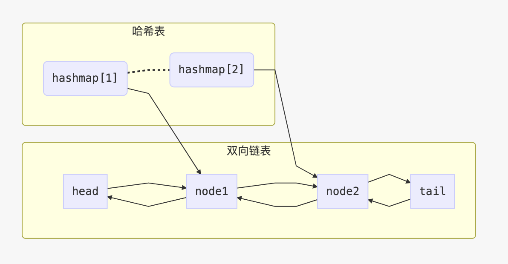

### 概念

英文：Array、Linked List、Skip List

SkipList : 添加索引的方式增加链表线性查找的效率（升维思想+空间换时间） 时间复杂度O(logn)  空间复杂度O(n)

### LRU缓存算法

Least Recently Used最近最少使用

实现LRU时，我们需要关注它的读性能和写性能，理想的LRU应该读写的时间复杂度都是O(1)。

这可以通过HashMap+双向链表实现。HashMap保证通过key访问数据的时间为O(1)，双向链表则按照访问时间的顺序依次穿过每个数据。之所以选择双向链表而不是单链表，是为了可以从中间任意结点修改链表结构，而不必从头结点开始遍历。

数据结构如下图所示：



实现代码如下：

```java
public class LRUCache {
  private HashMap<Integer, DLinkedNode> cache =
          new HashMap<Integer, DLinkedNode>();
  //缓存容量
  private int capacity;
  //访问时间较新
  private DLinkedNode head;
  //访问时间较早
  private DLinkedNode tail;
  public LRUCache(int capacity) {
    this.capacity = capacity;
    head = new DLinkedNode();
    // head.prev = null;
    tail = new DLinkedNode();
    // tail.next = null;
    head.next = tail;
    tail.prev = head;
  }

  public int get(int key) {
    //从Map中获取Node
    DLinkedNode node = cache.get(key);
    //如果不存在返回-1
    if (node == null) return -1;
    //将node移动到head
    moveToHead(node);
    return node.value;
  }

  public void put(int key, int value) {
    DLinkedNode node = cache.get(key);
    if(node == null) {
      DLinkedNode newNode = new DLinkedNode();
      newNode.key = key;
      newNode.value = value;
      cache.put(key, newNode);
      addNode(newNode);
			//如果map的大小大于capacity
      if(cache.size() > capacity) {
        // 移除tail
        DLinkedNode tail = popTail();
        cache.remove(tail.key);
      }
    } else {
      // 更新value值
      node.value = value;
      //移动node到head
      moveToHead(node);
    }
  }
  class DLinkedNode {
    int key;
    int value;
    DLinkedNode prev;
    DLinkedNode next;
  }
  
  private void addNode(DLinkedNode node) {
    node.prev = head;
    node.next = head.next;
    head.next.prev = node;
    head.next = node;
  }
  
  private void removeNode(DLinkedNode node){
    DLinkedNode prev = node.prev;
    DLinkedNode next = node.next;
    prev.next = next;
    next.prev = prev;
  }

  private void moveToHead(DLinkedNode node){
    removeNode(node);
    addNode(node);
  }

  private DLinkedNode popTail() {
    DLinkedNode res = tail.prev;
    removeNode(res);
    return res;
  }
}
```

### 实战练习

练习步骤：

1. 5-10分钟：读题和思考
2. 有思路：自己开始做和写代码；不然，马上看题解
3. 默写背诵、熟练
4. 然后开始自己写（闭卷）

##### 盛最多水的容器

[https://leetcode-cn.com/problems/container-with-most-water/](https://leetcode-cn.com/problems/container-with-most-water/ )

面积的公式：*S*(*i*,*j*)=*m**i**n*(*H*[*i*],*H*[*j*])∗(*j*−*i*)

解法：

1、*暴力法（n^2 , 1）*

```java
for(int i = 0; i < height.length; i++) {
        for(int j = i + 1; j < height.length; j++) 
            //logic
    }
```

2、*双指针法（n , 1）*

```java
public void maxArea(int[] height) {
	int maxarea = 0,l = 0, r = height.length - 1;
    while (l < r) {
        maxarea = Math.max(maxarea,Math.min(height[1],height[r]) * (r - l));
        if (height[l] < height[r])
            l++;
        else
            r--;
        return maxarea;
    }
}
```

反证法证明：通过双指针方法，两个指针一定会同时经过最大面积对应的指针位置

```txt
                  |                     
           |      |                     
           |      |                     
     ......|......|......               
——————————————————————————————————————— 
           m      n
```

如图，若m,n之间的面积为最大面积。

双指针方法的规律是：每次都会向内移动偏矮的指针（可观察案例）。要证明两个指针一定会移动到m和n位置，只需证明：

m左侧的指针点等于或矮于n，n右侧指针等于或矮于m。

假设m左侧有一个点p，高度高于n.

```txt
        |                                
        |          |                     
        |   |      |                     
        |   |      |                     
     ...|...|......|......               
——————————————————————————————————————— 
        p   m      n
```

因为:

```lisp
AreaMN = ( n - m ) * min( arr[ m ], arr[ n ] )
AreaPN = ( n - p ) * min( arr[ p ], arr[ n ] )
```

又：

```lisp
(  n - m ) <= ( n - p )
min( arr[ m ], arr[ n ] ) <= min( arr[ p ], arr[ n ] )
```

所以： `AreaMN < AreaPN`, 与m和n构成最大面积相矛盾，所以假设不成立，即m左侧的点都不高于n，即等于或矮于n。同理可证，n右侧指针等于或矮于m。所以通过双指针方法，两个指针一定会同时经过最大面积对应的指针位置。

##### 移动零

https://leetcode-cn.com/problems/move-zeroes/

1、遍历数组，无为0的元素移动数组前方，用index下标记录；遍历结束，对index值后的元素统一设为0

```java
public void moveZeroes(int[] nums) {
	int index = 0;
    for (int num : nums) {
        if (num != 0) {
            nums[index++] = num;
        }
    }
    //最后将index后面的填充0
    while (index < nums.length) {
        nums[index++] = 0;
    }
}
```

2、双指针法

变量j永远指向已处理好的第一个为零元素位置；依次便利数组，每次遇到非零元素，则与第一个为零的元素j进行位置交换

```java
public void moveZeroes(int[] nums) {
    int j = 0;
    for (int i = 0; i < nums.length; i++) {
        if (nums[i] != 0) {
            if (i != j) {
                nums[j] = nums[i];
                nums[i] = 0;
            }
            j++;
        }
    }
}
```

##### 三数之和

https://leetcode-cn.com/problems/3sum/


